# Flowchart & Diagram - Multi-Service ERP Platform

## 1. System Architecture Overview

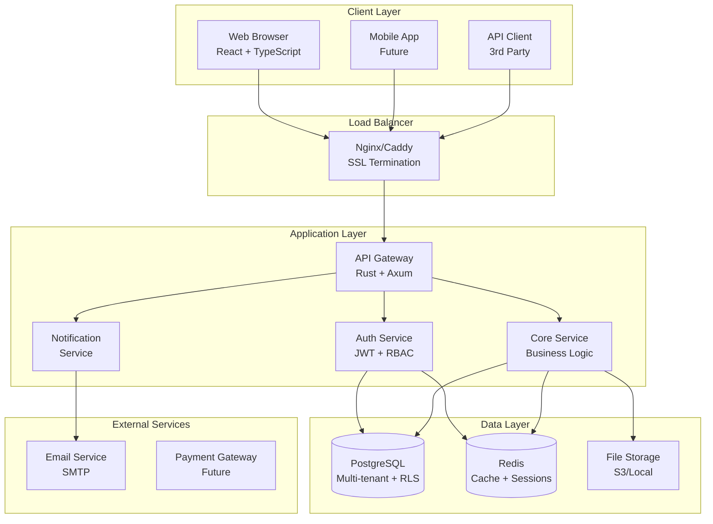

## 2. User Authentication Flow

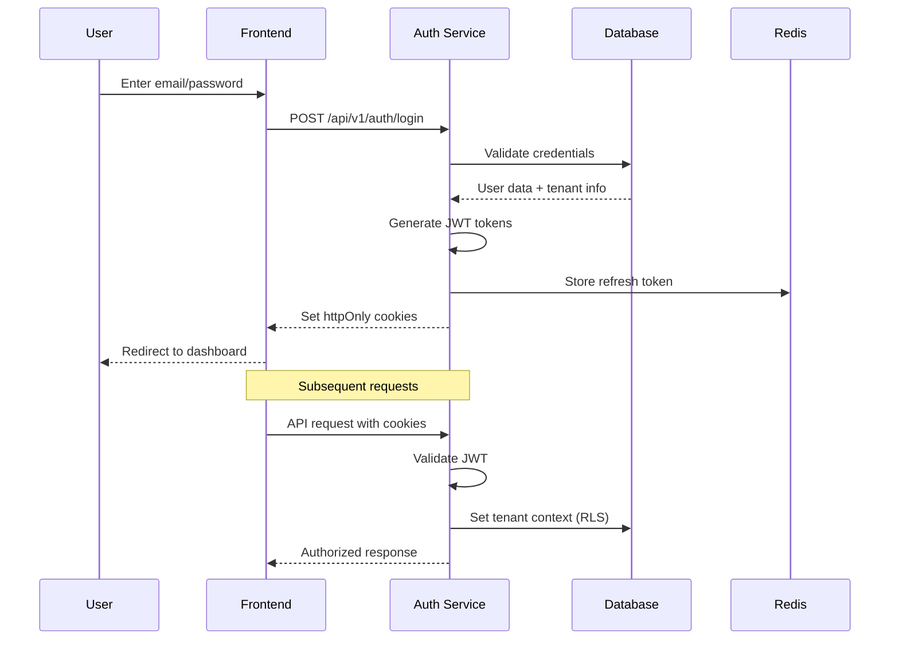

## 3. Multi-Tenant Data Access Flow

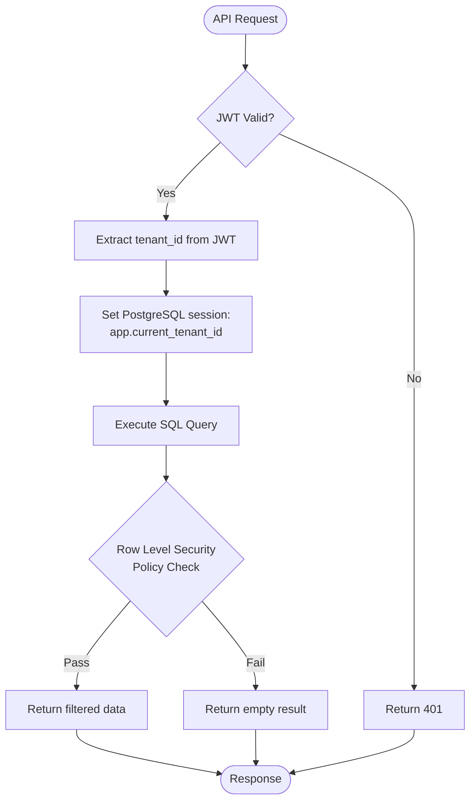

## 4. Business Process Flow - Lead to Cash

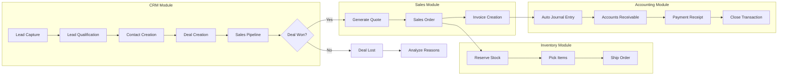

## 5. Procurement Process Flow - Purchase to Pay

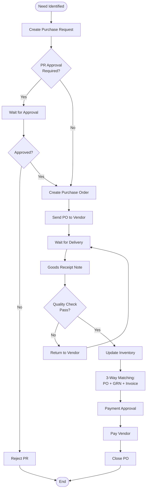

## 6. Inventory Management Flow

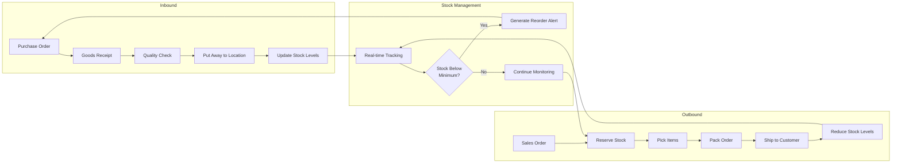

## 7. User Registration & Tenant Setup Flow

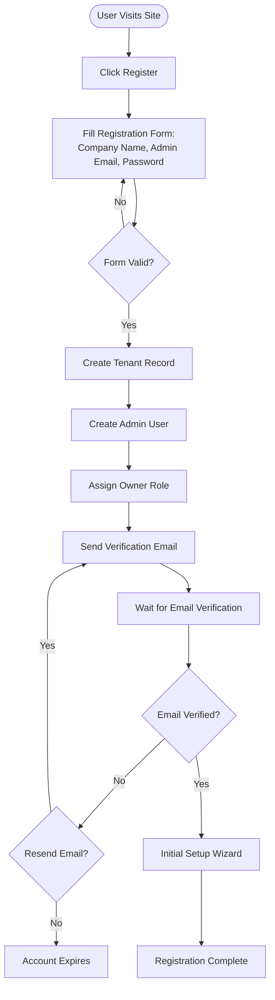

## 8. Role-Based Access Control (RBAC) Flow

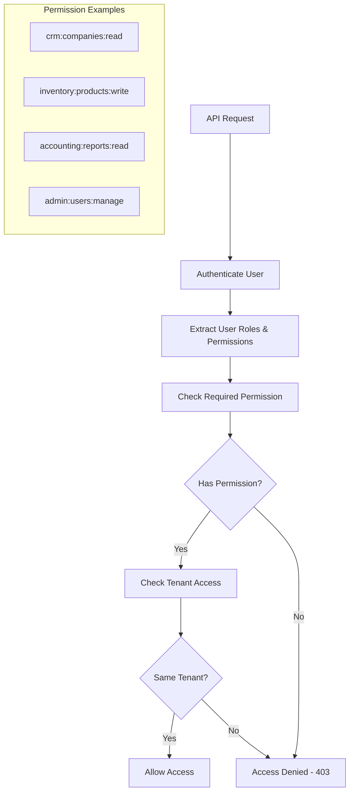

## 9. Data Integration Flow Between Modules

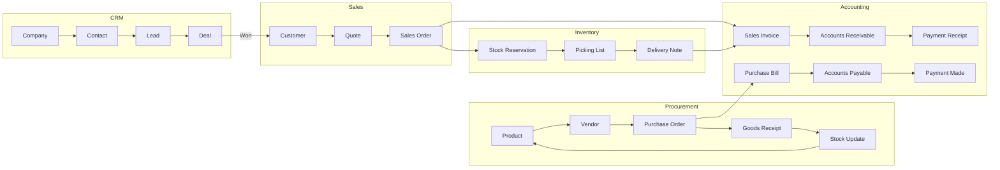

## 10. Error Handling & Recovery Flow

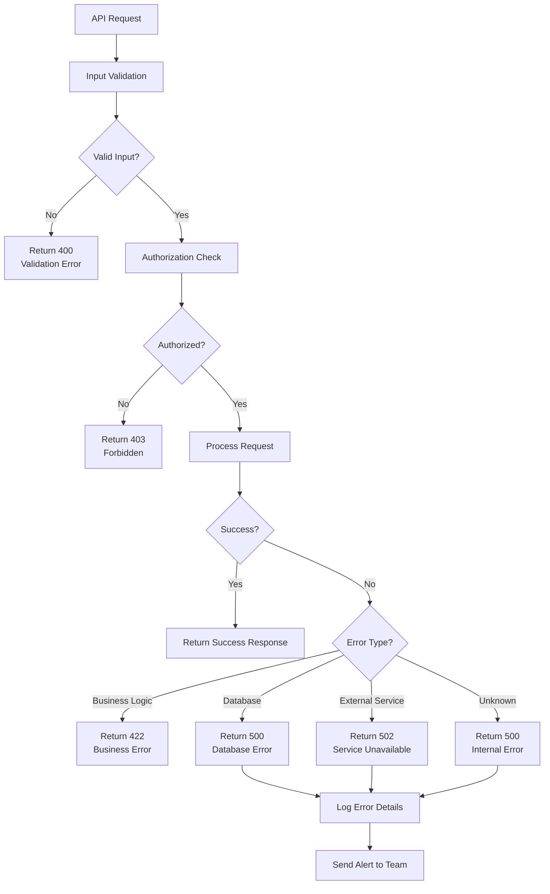

## 11. Deployment & CI/CD Flow

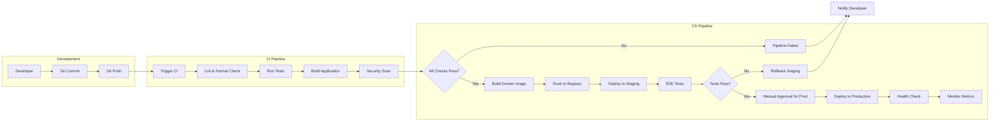

## 12. Database Schema Relationship

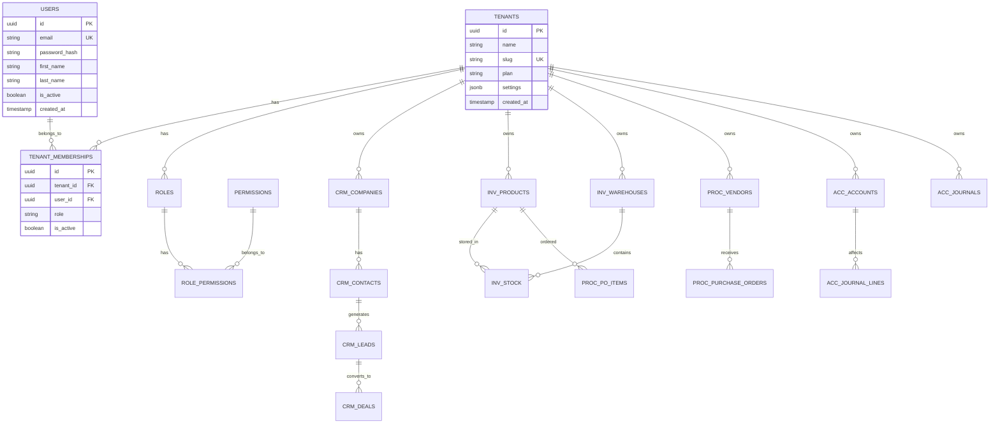

## 13. Security Architecture Flow

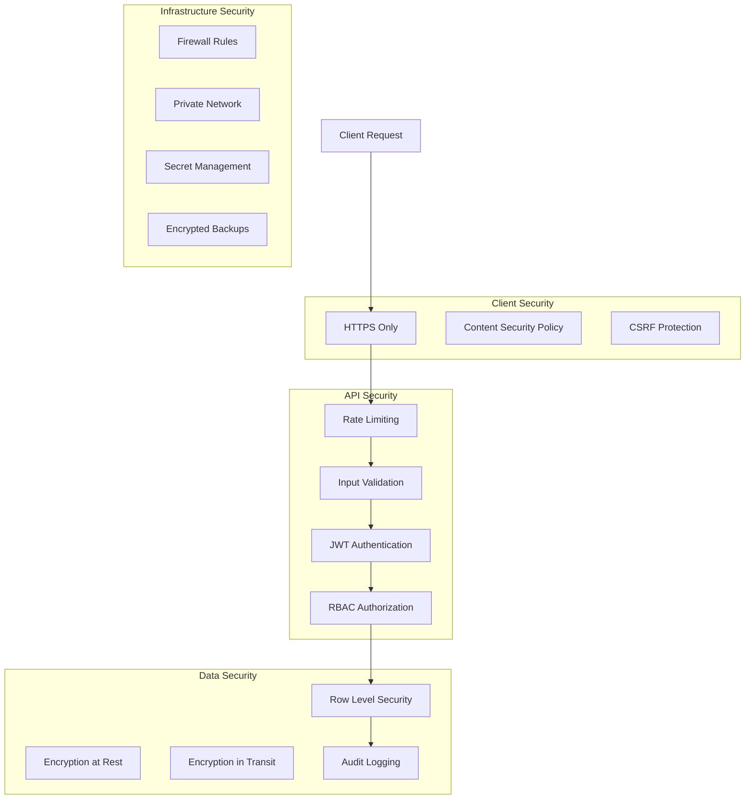

## 14. Monitoring & Observability Flow

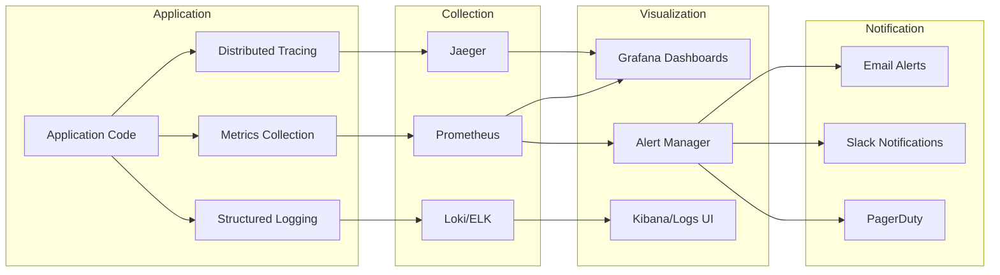

## 15. Mobile App Architecture (Future)

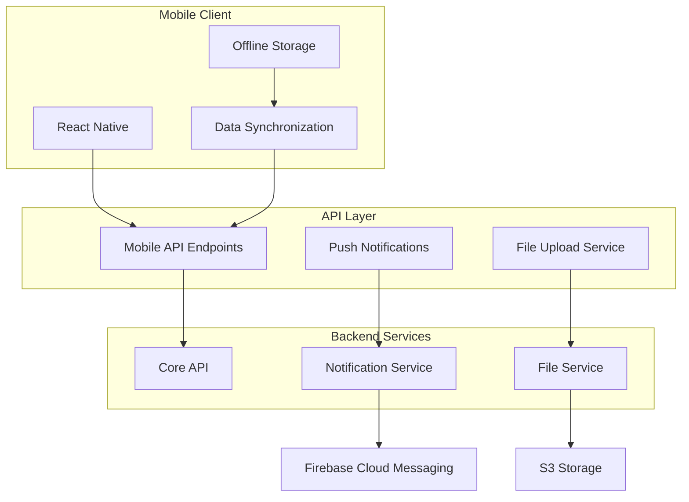

Diagram-diagram di atas memberikan visualisasi lengkap tentang:

1. **Arsitektur sistem** secara keseluruhan
2. **Alur autentikasi** dan keamanan multi-tenant
3. **Proses bisnis** end-to-end dari lead hingga payment
4. **Integrasi antar modul** dan flow data
5. **Error handling** dan recovery mechanisms
6. **CI/CD pipeline** untuk deployment
7. **Database relationships** dan struktur data
8. **Security layers** di semua tingkatan
9. **Monitoring** dan observability
10. **Future mobile architecture**

Setiap diagram menggunakan Mermaid syntax yang dapat di-render langsung di GitHub, GitLab, atau tools dokumentasi lainnya. Apakah ada diagram spesifik yang perlu diperjelas atau ditambahkan?
